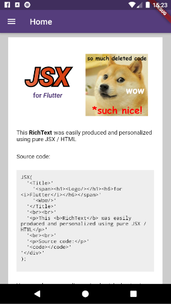
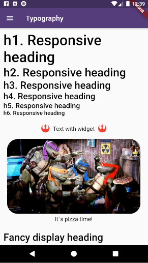
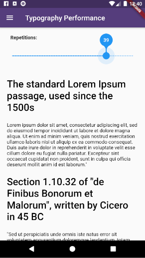

# About ```flutter_jsx``` plugin





This plugin provides a easy and productive way to work with [RichText] widget on Flutter Applications using HTML / JSX syntax.

Made by [Rafael Setragni](https://br.linkedin.com/in/rafael-setragni-55702823) to all Flutter's Community.

## Licensing

This project follows the GNU General Public License V3, wich means you can change the entire project the way as you want to, but you need to share your improvements back to the community.

To share your improvements, please first do a Fork of this project, change what you need to and finally do a pull request. And don´t let to share your ideas and needs on "Issues" page, even before to start your changes.


# IMPORTANT NOTES:

* This plugin was separated from [Flutter Responsive Plugin](https://pub.dev/packages/flutter_responsive) but you can use both plugins simultaneously without problem, as was used on our example project.
* You don´t need to use <></> to print many elements on same [RichText] widget, because this plugin are using by default children instead single child. But you can write (uselessly) this empty element if you wish. 
* Its not necessary to use expressions, because you can do whatever you want to inside a widget and, after that, include that final widget to replace a HTML element.
* The [DisplayLine] property was based on ```display: block``` Html property and works on same exactly way.
* Fell free to improve and change this project.


# How to Add the plugin

Add the dependency bellow into your ```pubspec.yaml``` file.

```yaml
dependencies:
  flutter_jsx: ^0.0.1 #Please, ensure to use the most updated version
```
Add the reference into your ```.dart``` files
```dart
import 'package:flutter_responsive/flutter_jsx.dart';
```
Use the Widget ```ResponsiveContainer```, ```ResponsiveRow```, ```ResponsiveCol``` and ```ResponsiveText``` as the way you want to.


# How to use

Just use the widget [JSX], passing by first parameter your HTML tags.

```dart
JSX(
    '<div>'
        '<Title><h1>JSX</h1><h6>for <i>Flutter</i></h6></Title>'
        '<br><br>'
        '<p>This <b>RichText</b> was easily produced and personalized using pure JSX / HTML</p>'
    '</div>'
);
```

## Applying styles to your JSX element

Its possible to apply custom styles to any HTML element using the ```stylesheet``` property:

```dart
JSX(
    '<div>'
        '<Title><h1>JSX</h1><h6>for <i>Flutter</i></h6></Title>'
        '<br><br>'
        '<p>This <b>RichText</b> was easily produced and personalized using pure JSX / HTML</p>'
    '</div>',
    stylesheet: {
      'Title': JSXStylesheet(
        width: 150,
        height: 150,
        displayLine: DisplayLine.inline,
        alignment: Alignment.center
      ),
      'h1': JSXStylesheet(
        displayLine: DisplayLine.inline
      ),
      'h6': JSXStylesheet(
        textStyle: TextStyle(color: Theme.of(context).primaryColor, fontWeight: FontWeight.bold)
      ),
    },
);
```


## Replacing Html elements by widgets

Its also possible to replace any HTML element by an widget using the ```widgets``` property:

```dart
JSX(
    '<div>'
        '<Title><h1>JSX</h1><h6>for <i>Flutter</i></h6></Title>'
        '<Wow/>'
        '<br><br>'
        '<p>This <b>RichText</b> was easily produced and personalized using pure JSX / HTML</p>'
    '</div>',
    widgets: {
       'Wow': Image.asset('assets/such_nice_code.jpg'),
    },
    stylesheet: {
      'Title': JSXStylesheet(
        width: 150,
        height: 150,
        displayLine: DisplayLine.inline,
        alignment: Alignment.center
      ),
      'Wow': JSXStylesheet(
        width: 150,
        height: 150,
          boxDecoration: BoxDecoration(color: Colors.blue),
        displayLine: DisplayLine.block
      ),
      'h1': JSXStylesheet(
        displayLine: DisplayLine.inline
      ),
      'h6': JSXStylesheet(
        textStyle: TextStyle(color: Theme.of(context).primaryColor, fontWeight: FontWeight.bold)
      ),
    },
);
```

# How to run the plugin example

This project is a starting point for a Flutter
[plug-in package](https://flutter.dev/developing-packages/),
a specialized package that includes platform-specific implementation code for
Android and/or iOS.

For help getting started with Flutter, view our 
[online documentation](https://flutter.dev/docs), which offers tutorials, 
samples, guidance on mobile development, and a full API reference.

To run the full example App, wich contains performance and case tests, do the steps bellow:

* Clone this project into your local machine using Github Desktop or any other git program of your preference.
* Download Android Studio and the last Flutter SDK into your local machine. Configure they to works properly such as [this article here](https://flutter.dev/docs/get-started/editor?tab=vscode)
* Run ```flutter pub get``` to update all the dependencies
* Debug the file ```example/lib/main.dart``` or any of the unity case tests located on ```test``` folder on emulator or real device.
* To run properly the performance tests, please run the app using ```flutter run --release```
